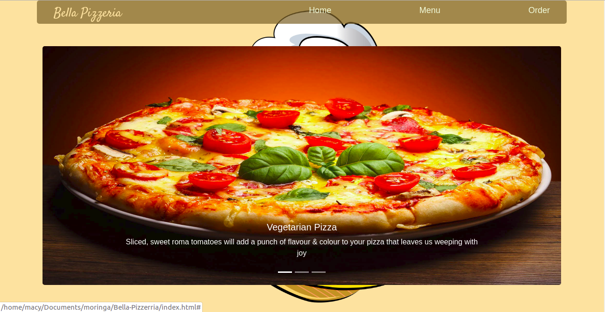

# Bella Pizzeria

#### Check out Bella Pizzeria [here](https://macymuhia.github.io/Bella-Pizzerria/)

Last modified 17th June 2019.
#### By **Mercy Muhia**
## Description
Bella Pizzeria is a website for the best Pizza place in Kenya. You can view the menu or order online. You can choose the pizza you want, the kind of crust and topping you would want and the number of pizzas you want.
## Project Behaviour
* A user can select the pizza you want
* A user can select the kind of crust you like
* A user can select the size of pizza you want
* A user can select the kind of topping you prefer
* A user can select the number of pizzas you want
* A user can choose if you want it delivered and input delivery place.
* A user can select the kind of crust you like
* A user can see total charged for pizza and delivery charges
* The site should be responsive.
* The user should know through a pop up that their order has been received and also thank them. For example: "*We have received your order, Thank you for being our valued customer.*"

 
## Setup/Installation Requirements
* Git clone https://github.com/macymuhia/Bella-Pizzerria.git
* cd Bella-Pizzerria
* open index.html file on your preferred browser
## Technologies Used
HTML, CSS(Bootstrap) and JQUERY
## Support and contact details
To contribute, submit a pull request. 
For questions or concerns, reach out on mercy8muhia@gmail.com
### License
*MIT*

### &copy; 2019 Mercy Muhia